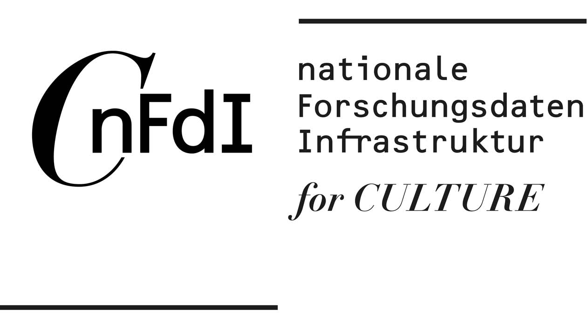

## Open Museum Guidebooks: A Citizen Science Experience

Computational Publishing Sevice (CPS) Proof of Concept Prototype - Citizen science open museum guidebooks. 

A prototype project being made with the students of the Bachelor of Arts Information Management, Hannover University of Applied Sciences and Arts - Seminar: BIM-126-02 Data Science (2025), March - June 2025.

The project is to create a system where museum visitors create their own publication guides to museums using linked open data. The project is intended as a citizen science project and for this reason aspects of participation by the public and engagement with scholarship and learning are a priority.

As a basis for the prototype the Computational Publishing Service demo is being used. See: [CPS Demo #2](https://nfdi4culture.github.io/cps-demo-2/)

The Spengel Museum Hannover will be used as the example museum. See the museum data profile on [Wikidata Resonator](https://reasonator.toolforge.org/?q=Q510144)

Project inspired by the 1700s database - Corpus [Johann Joachim Winckelmanns](https://en.wikipedia.org/wiki/Johann_Joachim_Winckelmann) (1717–1768). [Census.de](https://www.census.de/kooperationen/corpus-winckelmann/) 

## Idea

The idea! Museum have a calendar of exhibitions and a catalogue of what is on display in any give show. But this is not publishing in data repositories.

Welcome to 'Open Museum'! If museums made deposits of open data of what's on show — then their visitors could make 'play lists' of their favourite works and share them online.

The 'Open Museum' pitch is that the public take part in this cataloguing and a Citizen Science Experience.

The prototype 'Open Museum Guidebooks' has outlined the idea and is sharing the 'how to' model using Wikibase as a foundation. We believe all the infrastructure is already out there and with luck museums back catalogues could be online in no time (famous last words).

A project made the students of the Bachelor of Arts [Information Management (BIM)](https://f3.hs-hannover.de/en/courses/bachelor-studiengaenge/information-management-bim) of Hannover University of the Applied Science and Arts in partnership with [Computational Publishing Service](https://nfdi4culture.de/services/details/computational-publishing-service.html) from the Open Science Lab, TIB – Leibniz Information Centre for Science and Technology and University Library, and with NFDI4Culture – Consortium for Research Data on Material and Immaterial Cultural Heritage, as part of National Research Data Infrastructure (NFDI)

1. Use case

  - A museum visitor makes a list of items that are significant to them and they want to share. The list shows the item on a map and as a table, with links to more information and data.
  - A person finds the list online and make a visit to the museum.
  - The public catalogues exhibition dates and information on Wikidata. The public catalogues items on display in an exhibition.

2. Value proposition

  - The public can learn about chosen topics using museums.
  - The public can learn data science skills.
  - Museums can attract more visitors.
  - Museums can support deep learning in their respective knowledge domains.
  - A permanent record of museums work will be created.
  - Contributed to linked open data commons for researchers and the public

3. Personas and storyboarding (user needs / what is blocking the user)

  - Museum visitor: Needs: The visitor want to share info with friends and family about their favourite artworks. Blocking: The museum has no data feed of exhibition dates or what is being exhibited. If the visitor wanted to share the information it would be a long, long, labour of love.
  - Museum exhibition organiser: Needs: Visitors and engagement. Blocking: No exhibition data available for people to find out about contemporary or past exhibitions. The museum should have all this data but is not making it public.
  - Special interest group (Climate change education group): Need: Ensure access to understanding of climate change is represented in regional museums. The group would contribute volunteer time to cataloging efforts and outreach. Blocking: Not able to find dates of exhibitions or information about what was exhibited.

4. Problem / solution

  - Problem: A museum visitor cannot share information about exhibitions or the exhited items as museums don't publish this data.

  - Solution: Support museums visitors to publish and use the data as a citizen science project 'Open Museum'. The data is has two parts: 
    a. Calendar of exhibitions, and 
    b. Catalogue of items in an exhibition. 
    
    Both of these data would be catalogued and indexed using Wikimedia infrastructure.
  
5. A schematic

<pre>
+--------------------+            +---------------------+             +-------------------+
|                    |            |                     |             |                   |
|                    |            |                     |             |                   |
|                    |            |                     |             |                   |
|                    |            |                     |             |                   |
|       Data         +------------>     The public      +------------>|     Learning      |
|                    |            |                     |             |                   |
|                    |            |                     |             |                   |
|                    |            |                     |             |                   |
|                    |            |                     |             |                   |
+--------------------+            +---------------------+             +-------------------+
</pre>

---

## Concept development

## Wikibase - Making a Guide

This is a workflow to create a museum guide based on an Linked Open Data utilising Wikidata, Wikimedia Commons, Wikibase, and Wikipedia.

The guide and its items are stored in a Wikibase instance. Most of the data used in the items are pulled from Wikimedia Commons. If Wikidata entries exist, they will be linked to the items.

The goal is to make existing data usuable for the museum and the generated information accessible to the public.

## Foundational Assumptions / Ideal World Vision

The Open Museum (Idea World Vision)

- All artwork from exhibitions, architecture, and public art is databased with pictures and geolocation on *Wikimedia Commons*
- Some items have *Wikidata* and *Wikipedia* entries
- A calendar of a museums exhibitions exists in *Wikidata*

## Guide data model

Our example guide has 9 items. Because [9](https://en.wikipedia.org/wiki/9) is a magic number! 

(= has 9 Guide items)

### A Guidebook list 

- **Title / ID (mandatory)**
- Authors
- Creation date
- Description
- **List of guide items (mandatory)**
- Location
- Category (from Wikimedia Commons?)

| Label         | Example Value                                   | Datatype                                       | Note                                                          |
|---------------|-------------------------------------------------|------------------------------------------------|---------------------------------------------------------------|
| Title         | *Sprengel Guide* or *Q001*                          | Text                                           | mandatory. can be a Q-number                                  |
| Author        | *Erika Mustermann*                                | String, or maybe Item if we have user accounts | optional, repeatable.                                         |
| Creation Date | *2025-04-07*                                      | Point in Time                                  | optional                                                      |
| Description   | *Guide to the public art around Sprengel museum.* | String                                         | optional                                                      |
| Guide Item    | *Another Twister*                                 | Item                                           | mandatory, repeatable. for 9 items we need 9 of these entries |
| Location      | *Hanover*                                         | String                                         | optional                                                      |
| Category      | *Images of Sculptures*                            | String                                         | optional                                                      |

## A Guide Item

(= part of Guide object)

- Title
- Picture
- Geolocation / coordinates
- Description
- Wikidata ID (if available)

→ ideally, all this info can be taken from Wikimedia Commons

| Label       | Example Value                                                 | Datatype               | Note                                                                                                                      |
|-------------|---------------------------------------------------------------|------------------------|---------------------------------------------------------------------------------------------------------------------------|
| Title       | *Another Twister* or *Q20*                                        | String                 |                                                                                                                           |
| Picture     | *Another_Twister.jpg*                                           | Commons media file     | automatically searches the *File:* namespace on Commons                                                                     |
| Geolocation | *52.363442, 9.739542*                                           | Geographic coordinates |                                                                                                                           |
| Description | *Sculpture by Alice Aycock*                                     | String                 |                                                                                                                           |
| Wikidata ID | *Q523722* (transforms to *https://www.wikidata.org/wiki/Q523722*) | External identifier    | can be used to get additional information, such as links to Wikipedia. the property has to be set up with a [formatter URL](https://www.wikidata.org/wiki/Property:P1630) |

## Possible Additions

### Timeline

→ for an overview of architecture

→ take one building (Sprengel museum) and document when its individual buildings were added

## Related work

https://calnfynn.github.io/KarteHannover/ 

## Run Notebooks

### Project status and roadmap

   1. Ideation  
   2. Wikidata and Wikibase technical setup
   3. Assign roles
   4. Technical tests
   5. Iteration
   6. Presentation and scholarly deposit - Current

### Tutorials

  - CPS Demo publishing Github Template use - https://github.com/NFDI4Culture/cps-demo-2/wiki
  - Using and editing Wikidata and wikibase - https://www.wikidata.org/wiki/Wikidata:In_one_page | https://dashboard.wikiedu.org/training/wikidata-professional/orientation-wikidata-professional | https://meta.wikimedia.org/wiki/A_Beginner%27s_Guide_to_Wikidata_for_Cultural_Heritage | https://learn.wiki/courses
  - Wiki Commons bulk image upload - https://computational-publishing-service.wikibase.cloud/wiki/Upload_Images_to_Wikimedia_Commons 
  - Wiki Commons to Wikibase Cloud bulk image metadata upload - https://computational-publishing-service.wikibase.cloud/wiki/Tutorial
  - Create an organisation data profile and dashboard - To be confirmed

### Ideas being worked with

  - History from below or people's history or perspective of people in Hannover
  - Timelines
  - Images guide on a map
  - Why don't museums have a timeline of future shos and past shows - like ical?
  - How to connect people's history with scholarly works stories
  - What is the mission, goals, programmes, and measuring of suceess of the museum organisation?
  - What open research profile and policies does the organisation have?

### Teaching Modules

  - How to get images on a map - https://commons.wikimedia.org/wiki/File:Sprengel_Museum_Hannover_entrance_Kurt-Schwitters-Platz_Suedstadt_Hannover_Germany_02.jpg
  - 
[https://wikimap.toolforge.org/?wp=false&cluster=false&zoom=16&lat=052.363410&lon=0009.739315](https://wikimap.toolforge.org/?wp=false&cluster=false&zoom=16&lat=052.363410&lon=0009.739315)

  - How to make timelines
  - How to make an organisations data Dashboard to catalogue from Wikidata
